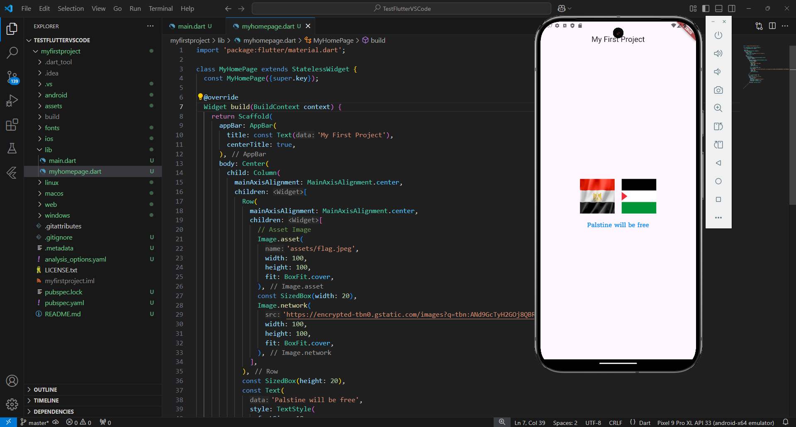

# My First Flutter Project

This is a simple Flutter application that displays two images and customized text in a stateless widget.

## Features
- **AppBar**: Displays the title of the page.
- **Images**: 
  - One loaded from project assets.
  - One loaded from the internet.

## Example Output

